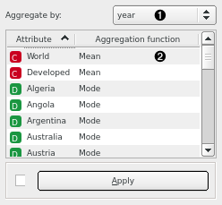

Aggregate
=========

Aggregate data by second, minute, hour, day, week, month, or year.

**Inputs**

- Time series: Time series as output by **As Timeseries** widget.

**Outputs**

- Time series: Aggregated time series.

**Aggregate** joins together instances at the same level of granularity. In other words, if aggregating by day, all instances from the same day will be merged into one. Aggregation function can be defined separately based on the type of the attribute.

1. Interval to aggregate the time series by. Options are: second, minute, hour, day, week, month, or year.
2. Aggregation function for each of the time series in the table. Discrete variables (sequences) can only be aggregated using mode (i.e. most frequent value), whereas string variables can only be aggregated using string concatenation.

#### See also

[Moving Transform](moving_transform_w.md)
