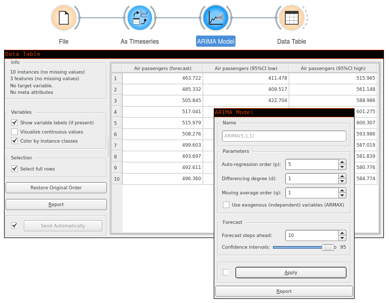

ARIMA Model
===========

Model the time series using [ARMA](https://en.wikipedia.org/wiki/Autoregressive%E2%80%93moving-average_model), ARIMA, or ARIMAX model.

**Inputs**

- Time series: Time series as output by [As Timeseries](as_timeseries.md) widget.
- Exogenous data: Time series of additional independent variables that can be used in an ARIMAX model.

**Outputs**

- Time series model: The ARIMA model fitted to input time series.
- Forecast: The forecast time series.
- Fitted values: The values that the model was actually fitted to, equals to *original values - residuals*.
- Residuals: The errors the model made at each step.

Using this widget, you can model the time series with ARIMA model.

1. Model's name. By default, the name is derived from the model and its parameters.
2. ARIMA's [p, d, q parameters](https://en.wikipedia.org/wiki/Autoregressive_integrated_moving_average).
3. Use exogenous data. Using this option, you need to connect
   additional series on the *Exogenous data* input signal.
4. Number of forecast steps the model should output, along with the desired
   confidence intervals values at each step.

Example
-------

#### See also

[VAR Model](var.md), [Model Evaluation](model_evaluation_w.md)
