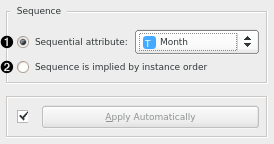
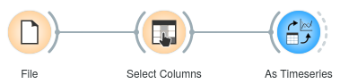

As Timeseries
=============

Reinterpret a **Table** object as a Timeseries object.

**Inputs**

- Data: Any data table.

**Outputs**

- Time series: Data table reinterpreted as time series.

This widget reinterprets any data table as a time series, so it can be used with the rest of the widgets in this add-on. In the widget, you can set which data attribute represents the time variable.

1. The time attribute, the values of which imply measurements' order and spacing. This can be any continuous attribute.
2. Alternatively, you can specify that the time series sequence is implied by instance order.

Example
-------

The input to this widget comes from any data-emitting widget, e.g. the **File** widget. Note, whenever you do some processing with Orange core widgets, like the **Select Columns** widget, you need to re-apply the conversion into time series.

