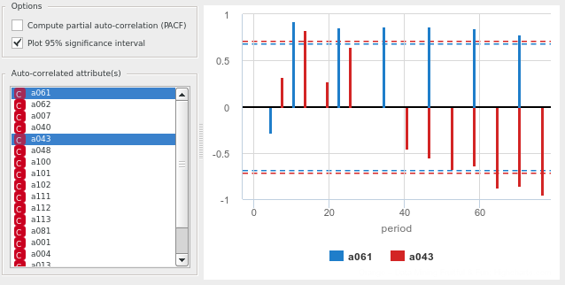
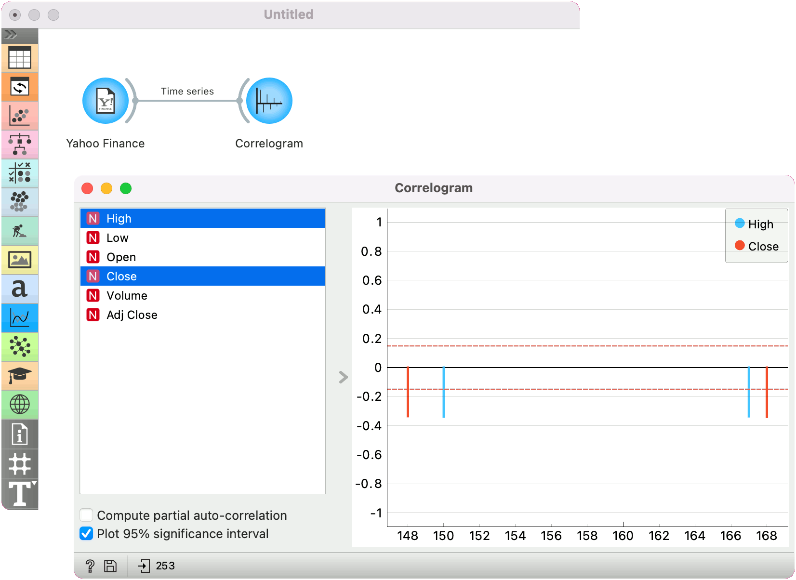

Correlogram
===========

Visualize variables' auto-correlation.

**Inputs**

- Time series: Time series as output by [As Timeseries](as_timeseries.md) widget.

In this widget, you can visualize the autocorrelation coefficients for the selected time series.

1. Select the series to calculate autocorrelation for.
2. Choose to calculate the coefficients using partial autocorrelation function (PACF) instead. Choose to plot the 95% significance interval (dotted horizontal line). Coefficients that are outside of this interval might be significant.

Example
-------

Here is a simple example on how to use the Periodogram widget. We have passed the [Yahoo Finance](yahoo_finance.md) data to the widget and plotted the autocorrelation of Amazon stocks for the past 6 years.

#### See also

[Periodogram](periodogram_w.md)
