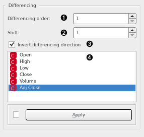

Difference
==========

Make the time series stationary by replacing it with 1st or 2nd order discrete difference along its values.

**Inputs**

- Time series: Time series as output by [As Timeseries](as_timeseries.md) widget.

**Outputs**

- Time series: Differences of input time series.

1. Order of differencing. Can be 1 or 2.
2. The shift before differencing. Value of 1 equals to discrete differencing. You can use higher values to compute the difference between now and this many steps ahead.
3. Invert the differencing direction.
4. Select the series to difference.

To integrate the differences back into the original series (e.g. the forecasts), use the [Moving Transform](moving_transform.md) widget.
