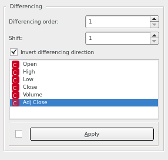
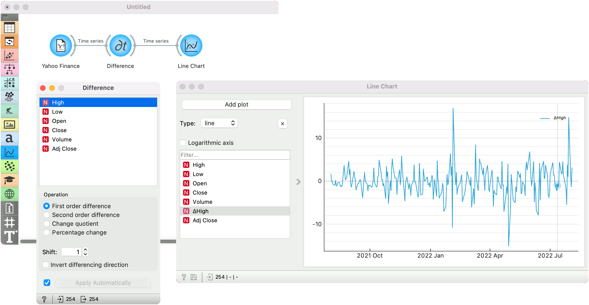

Difference
==========

Make the time series stationary by replacing it with 1st or 2nd order discrete difference along its values.

**Inputs**

- Time series: a dataset, often as output by [As Timeseries](as_timeseries.md) widget.

**Outputs**

- Time series: differences of input time series.

1. Select the series to difference.
2. Order of differencing. Options are first or second order difference, change quotient and percentage change.
3. The shift before differencing. Value of 1 equals discrete differencing. You can use higher values to compute the difference between now and this many steps ahead. *Invert differencing direction* compute differences from latest to oldest. 

To integrate the differences back into the original series (e.g. the forecasts), use the [Moving Transform](moving_transform_w.md) widget.

Example
-------

In this example, we are using the [Yahoo Finance](yahoo_finance.md) data for Amazon stocks for the past 6 years. We pass the data to **Difference** to compute the daily change in the high value of stocks. We observe the change in the [Line Chart](line_chart.md) widget.

