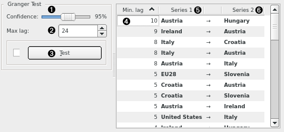

Granger Causality
=================

Test if one time series Granger-causes (i.e. can be an indicator of) another time series.

**Inputs**

- Time series: Time series as output by [As Timeseries](as_timeseries.md) widget.

This widgets performs a series of statistical tests to determine the series that cause other series so we can use the former to forecast the latter.

1. Desired level of confidence.
2. Maximum lag to test to.
3. Runs the test.
4. Denotes the minimum lag at which one series can be said to cause another. In the first line of the example above, if we have the monthly unemployment rate time series for Austria, we can say something about unemployment rate in Hungary 10 months ahead.
5. The causing (antecedent) series.
6. The effect (consequent) series.

The time series that Granger-cause the series you are interested in are good candidates to have in the same [VAR](var.md) model. But careful, even if one series is said to Granger-cause another, this doesn't mean there really exists a causal relationship. Mind your conclusions.
