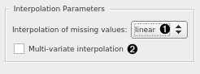
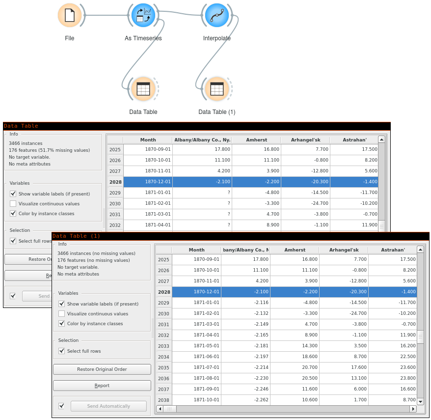

Interpolate
===========

Induce missing values in the time series by interpolation.

Signals
-------

Inputs
~~~~~~

-  **Time series**

   Time series as output by :doc:`As Timeseries <as_timeseries>` widget.

Outputs
~~~~~~~

-  **Time series**

   The input time series but preset with chosen default interpolation method
   for when algorithms require interpolated time series (without missing
   values).

-  **Interpolated time series**

   The input time series with any missing values interpolated according to
   chosen interpolation method.

Description
-----------

Most time series algorithms assume, you don't have any missing values in
your data. In this widget, you can chose the interpolation method to impute
the missing values with. By default, it's linear interpolation (fast and
reasonable default).

1. Interpolation type. You can select one of linear, cubic spline, nearest, or mean interpolation.
   **Linear** interpolation replaces missing values with linearly-spaced values
   between the two nearest defined data points. **Spline** interpolation fits a
   cubic polynomial to the points around missing values. This is a painfully
   slow method that usually gives best results. **Nearest** interpolation
   replaces missing values with the previous defined value. **Mean**
   interpolation replaces missing values with the series mean.

2. Select **Multi-variate interpolation** to interpolate the whole series
   table as a two-dimensional plane instead of as separate single-dimensional
   series.

.. note:: Missing values on the series' end points (head and tail)
   are always interpolated using *nearest* method.

.. note:: Unless the interpolation method is set to *nearest*, discrete
   time series (i.e. sequences) are always imputed with
   the series *mode* (most frequent value).

Example
-------

Pass a time series with missing values in, get interpolated time series out.

