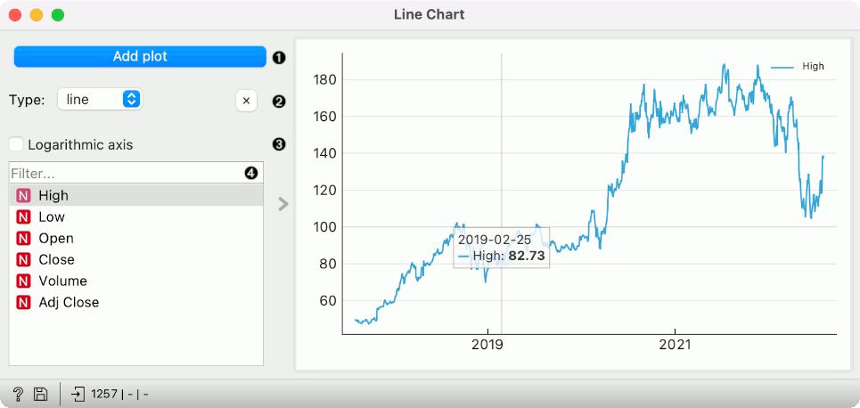
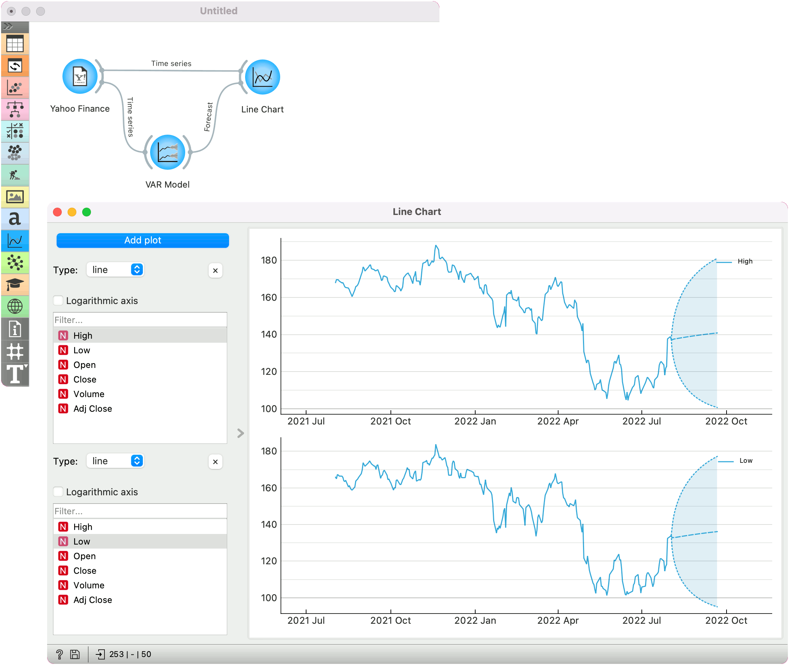

Line Chart
==========

Visualize time series' sequence and progression in the most basic time series visualization imaginable.

**Inputs**

- Time series: a dataset, often as output by [As Timeseries](as_timeseries.md) widget.
- Features: list of attributes
- Forecast: time series forecast as output by one of the models (like [VAR](var.md) or [ARIMA](arima.md)).

You can visualize the time series in this widget. Note that the *line* option will display the data as a connected line. In case of non-existent dates, the widget will show them, then the line will be drawn over to connect the last known value with the next one. In case of missing values, the widget will not draw the line in the given place, making the chart disconnected. To better see the missing values, we recommend using the *column* option.

1. Add a new line chart below the current charts. The widget can display up to 5 parallel charts.
2. Set the type of chart. Options are: *line*, *step line*, *column*, *area*. X button removes the associated chart.
3. Switch between linear and logarithmic *y* axis.
4. Select the time series to display (select multiple series using the *Ctrl*/*Cmd* key). Filter enables searching for the desired variable from the list by its name.

Example
-------

The example uses [Yahoo Finance](yahoo_finance.md) data for the previous year. We can observe the data in the **Line Chart**.

To see the forecast, we have used the [VAR Model](var.md) for training the model. Then, we have attached the model's forecast to the *Forecast* input signal of the Line Chart. The forecast is drawn with a dotted line and the confidence intervals as an ranged area.

