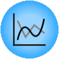

Line Chart
==========

Visualize time series' sequence and progression in the most basic time series
visualization imaginable.

Signals
-------

Inputs
~~~~~~

-  **Time series**

   Time series as output by :doc:`As Timeseries <as_timeseries>` widget.

-  **Forecast**

   Time series forecast as output by one of the models (like :doc:`VAR <var>` or :doc:`ARIMA <arima>`).

Description
-----------

You can visualize the time series in this widget.

.. figure:: images/line-chart-stamped.png

1. Stack a new line chart below the current charts.
2. Remove the associated stacked chart.
3. Type of chart to draw. Options are: *line*, *step line*, *column*, *area*, *spline*.
4. Switch between linear and logarithmic *y* axis.
5. Select the time series to preview (select multiple series using ``Ctrl`` key).
6. See the selected series in this area.

Example
-------

Attach the model's forecast to the *Forecast* input signal to preview it.
The forecast is drawn with a dotted line and the confidence intervals as an
ranged area.

.. figure:: images/line-chart-ex1.png
