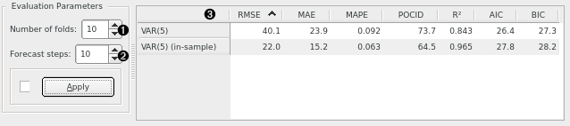

Model Evaluation
================

Evaluate different time series' models.

**Inputs**

- Time series: Time series as output by [As Timeseries](as_timeseries.md) widget.
- Time series model(s): The time series model(s) to evaluate (e.g. [VAR](var.md) or [ARIMA](arima.md)).

Evaluate different time series' models. by comparing the errors they make in terms of: root mean squared error ([RMSE](https://en.wikipedia.org/wiki/Root-mean-square_deviation)), median absolute error ([MAE](https://en.wikipedia.org/wiki/Mean_absolute_error)), mean absolute percent error ([MAPE](https://en.wikipedia.org/wiki/Mean_absolute_percentage_error)), prediction of change in direction (POCID), coefficient of determination ([R²](https://en.wikipedia.org/wiki/Coefficient_of_determination)), Akaike information criterion (AIC), and Bayesian information criterion (BIC).

1. Number of folds for time series cross-validation.
2. Number of forecast steps to produce in each fold.
3. Results for various error measures and information criteria on cross-validated and in-sample data.

[This slide](https://image.slidesharecdn.com/granada-140207061551-phpapp01/95/automatic-time-series-forecasting-71-638.jpg?cb=1392426574) ([source](http://www.slideshare.net/hyndman/automatic-time-series-forecasting)) shows how cross validation on time series is performed. In this case, the number of folds (1) is 10 and the number of forecast steps in each fold (2) is 1.

In-sample errors are the errors calculated on the training data itself. A stable model is one where in-sample errors and out-of-sample errors don't differ significantly.

####See also

[ARIMA Model](arima.md), [VAR Model](var.md)
