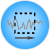
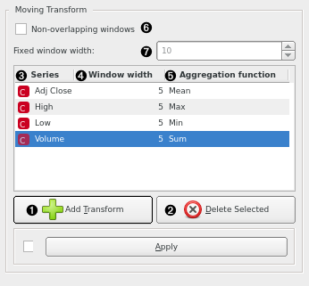
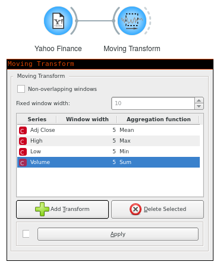
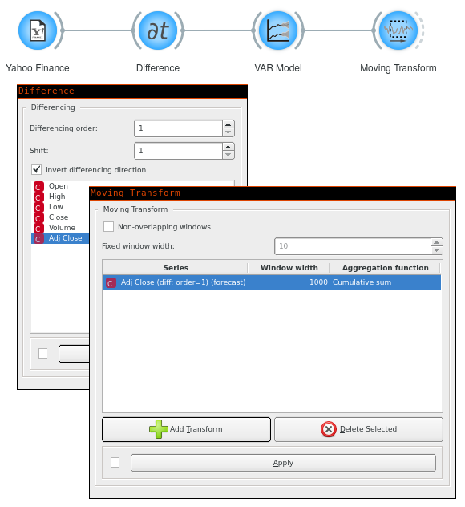

Moving Transform
================

Apply rolling window functions to the time series. Use this widget to get a
series' mean.

Signals
-------

Inputs
~~~~~~

-  **Time series**

   Time series as output by :doc:`As Timeseries <as_timeseries>` widget.

Outputs
~~~~~~~

-  **Time series**

   The input time series with added series transformations.

Description
-----------

In this widget, you define what aggregation functions to run over the time
series and with what window sizes.

1. Define a new transformation.
2. Remove the selected transformation.
3. Time series you want to run the transformation over.
4. Desired window size.
5. Aggregation function to aggregate the values in the
   window with. Options are:
   *mean*, *sum*, *max*, *min*, *median*, *mode*,
   *standard deviation*, *variance*, *product*,
   *linearly-weighted moving average*, *exponential moving average*,
   *harmonic mean*, *geometric mean*, *non-zero count*,
   *cumulative sum*, and *cumulative product*.
6. Select *Non-overlapping windows* options if you don't want the moving
   windows to overlap but instead be placed side-to-side with zero intersection.
7. In the case of non-overlapping windows, define the fixed window width
   (overrides and widths set in (4).

See also
--------
:doc:`Seasonal Adjustment <seasonal_adjustment>`

Example
-------

To get a 5-day moving average, we can use a rolling window with *mean*
aggregation.

To integrate a differenced time series, use *Cumulative sum* aggregation over
a window wide enough to grasp the whole series.

