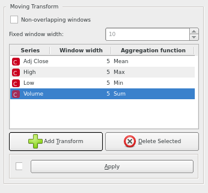
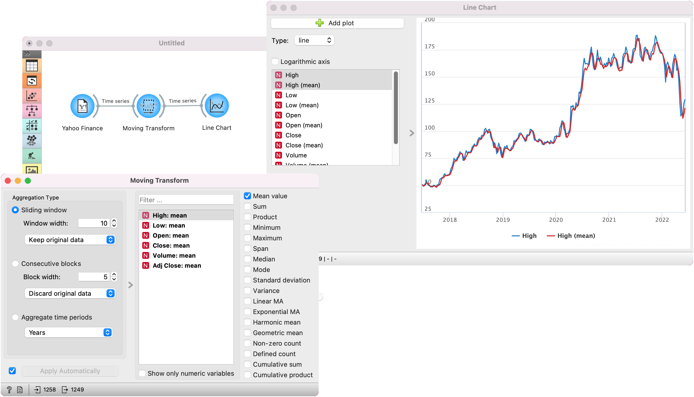
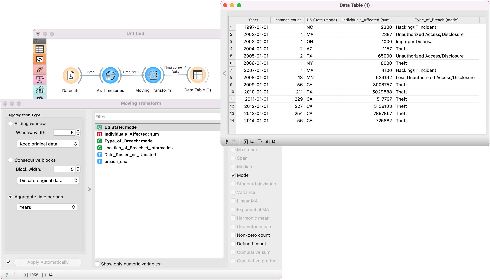

Moving Transform
================

Compute aggregations over a sliding window, consecutive blocks or time periods of time series.

**Inputs**

- Time series: Time series (e.g. one provided by [As Timeseries](as_timeseries.md) widget).

**Outputs**

- Time series: Data with computed aggregations

1. Define the method for forming blocks of data:
   - *Sliding window*: use a sliding window of the specified width. The function is often used for smoothing the data.
      - *Window width*: the number of instances in a window
      - Data output: *Discard original data* outputs only computed columns; *Keep original data* also keeps the original data except for the first N-1 instances (where N is the window width), which occur before the first complete window; *Include leading instances* also includes the first N-1 instances, but with missing values for entries in the computed columns.
   - *Consecutive blocks*: aggregates data within consecutive blocks
      - *Block width*: the number of instances in block
      - Data output: *Discard original data* will output only aggregated columns; *Keep first instance*, *Keep middle instance* and *Keep last instance* will take the first, middle or last data instance as the representative for the block.
   - *Aggregate time periods*: aggregates data based on time periods (years, months, days, hours, minutes, seconds) or in the same month of year (12 instances), day of year (365 or 366 instances), day of month (~31 instances), day of week (7 instances), hour of day (24 instances). This functionality replaces the *Aggregate widget*.
2. If *Apply Automatically* is ticked, changes are communicated automatically. Alternatively, click *Apply*.
3. Variable selection:
   - Filter provides a shortcut for searching variables by (a part of) the name. Start typing the variable name to select it from the list.
   - Alternatively, select the variable from the variable list. You can use Ctrl (Cmd) key, or dragging across the list, to select multiple variables and apply the same aggregation on them.
   - *Show only numeric variables* hides non-numeric variables from the variable list.
4. A list of possible aggregations:
   - Mean value
   - Sum
   - Product
   - Minimum
   - Maximum
   - Span
   - Median
   - Mode
   - Standard deviation
   - Variance
   - [Linear MA](https://en.wikipedia.org/wiki/Moving_average#Weighted_moving_average)
   - [Exponential MA](https://en.wikipedia.org/wiki/Moving_average#Exponential_moving_average)
   - [Harmonic mean](https://en.wikipedia.org/wiki/Harmonic_mean)
   - [Geometric mean](https://en.wikipedia.org/wiki/Geometric_mean)
   - Non-zero count: count non-zero values
   - Defined count: count the number of non-missing values
   - Cumulative sum
   - Cumulative product

Examples
--------

A simple use case for **Moving Transform** is applying a smoothing function over the timeseries. We used the [Yahoo Finance](yahoo_finance.md) to retrieve the daily stock value for Amazon (AMZN) and passed the data to Moving Transform. To get a 5-day moving average, we used a rolling window with *mean* aggregation. In [Line Chart](line_chart.md), we can see the initial (blue) values of *High* variable are now smoothed (red line).

Another way of using Moving Transform is to aggregated the data by a given period. Let's say we wish to observe the yearly averages for the *Cyber security breaches* data from the [Datasets](https://orangedatamining.com/widget-catalog/data/datasets/) widget. We set *breach_start* as our time variable in [As Timeseries](as_timeseries.md). In Moving Transform, we aggregated by years, and used mode for *US State* and *Type of Breach* variables and sum for the *Individuals Affected* variable. In the [Data Table](https://orangedatamining.com/widget-catalog/data/datatable/) we see the aggregated data. There are 14 instances, each representing a single year.

#### See also

[Seasonal Adjustment](seasonal_adjustment.md)
