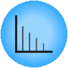

Periodogram
===========

Visualize time series' cycles, seasonality, periodicity, and most significant periods.

Signals
-------

Inputs
~~~~~~

-  **Time series**

   Time series as output by :doc:`As Timeseries <as_timeseries>` widget.

Description
-----------

In this widget, you can visualize the most significant periods of the time series.

.. figure:: images/periodogram-stamped.png

1. Select the series to calculate the periodogram for.
2. See the periods and their respective relative power spectral density estimates.

.. note:: Periodogram for non-equispaced series is calculated using Lomb-Scargle method.

See also
--------

:doc:`Correlogram <correlogram>`
