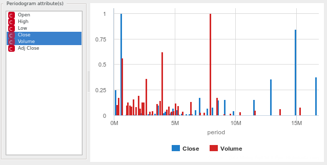
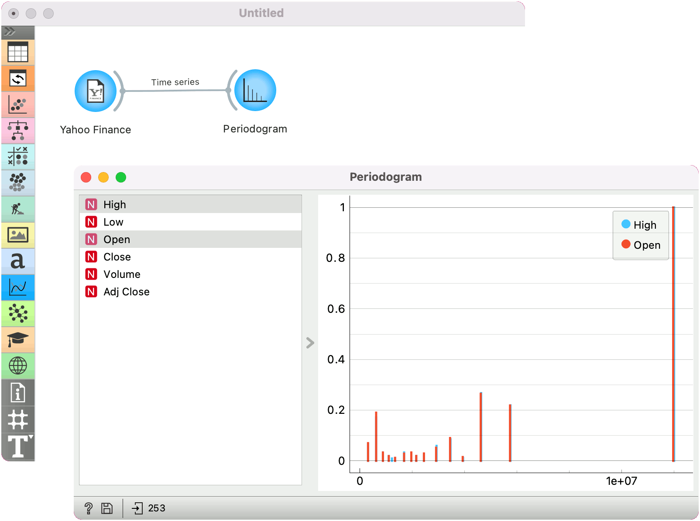

Periodogram
===========

Visualize time series' cycles, seasonality, periodicity, and most significant periods.

**Inputs**

- Time series: Time series from the File or as output by [As Timeseries](as_timeseries.md) widget.

In this widget, you can visualize the most significant periods of the time series.

1. Select the series to calculate the periodogram for.

Periodogram for non-equispaced series is calculated using Lomb-Scargle method.

Example
-------

Here is a simple example on how to use the Periodogram widget. We have passed the [Yahoo Finance](yahoo_finance.md) data to the widget and plotted the periodicity of Amazon stocks for the past 6 years.

#### See also

[Correlogram](correlogram.md)
