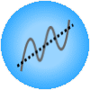

Seasonal Adjustment
===================

Decompose the time series into seasonal, trend, and residual components.

Signals
-------

Inputs
~~~~~~

- **Time series**

  Time series as output by :doc:`As Timeseries <as_timeseries>` widget.

Outputs
~~~~~~~

- **Time series**

  Original time series with some additional columns:
  seasonal component, trend component, residual component, and seasonally adjusted time series.

Description
-----------

.. figure:: images/seasonal-adjustment-stamped.png

1. Length of the season in periods (e.g. 12 for monthly data).
2. Time series `decomposition model <https://en.wikipedia.org/wiki/Decomposition_of_time_series>`_, additive or multiplicative.
3. The series to seasonally adjust.

See also
--------
:doc:`Moving Transform <moving_transform>`

Examples
--------

.. figure:: images/seasonal-adjustment-ex1.png
