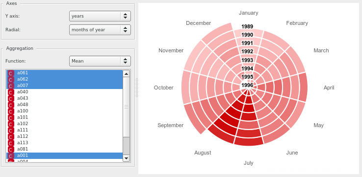
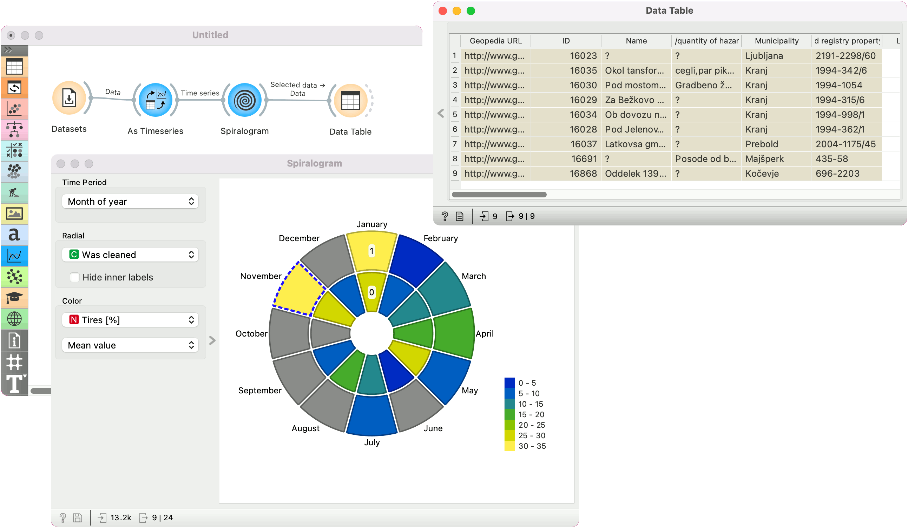

Spiralogram
===========

Visualize time series' periodicity in a spiral heatmap.

**Inputs**

- Time series: Time series from File or as output by [As Timeseries](as_timeseries.md) widget.

**Outputs**

- Selected Data: instances selected from the plot
- Statistics: data table with statistics as shown in the plot

Spiralogram is intended for visualizing time series and for comparing attribute values by categorical variables. Instances can be selected from the plot and sent downstream.

1. Units on the circumference. Options are: month of year (12 units), day of year (365 units), day of month (~30 units), day of week (Mon-Sun, 7 units), hour of day (24 units) and all the variables from the data.
2. Unit of the vertical axis. *Hide inner labels* removes labels on the vertical axis.
3. Color of each spiralogram section. Default is *Show instance count*. If an attribute from the data is selected, aggregation methods become available. The options are: mean value, sum, product, minimum, maximum, span, median, mode, standard deviation, variance, harmonic mean, geometric mean, non-zero count, and defined count.

Example
-------

In the example below we are using *Illegal waste dumpsite in Slovenia* data, available from the Datasets widget. The data record when the dumpsite was registered, what kind of waste was deposited, whether the site was cleaned, and so on.

We will use [As Timeseries](as_timeseries.md) for set *Entry creation date* as our time series variable. Then we pass the data to **Spiralogram**. The widget offers many option, so we will show here a slightly more complex set-up.

We split the circle into months of the year. Next, we split the vertical axis by an attribute *Was cleaned*, meaning the outer circle shows cleaned dumpsites and the inner circle the ones with the trash. Finally, we set the color to *Tires [\%]* and stick with the default *Mean value*. This will display the average percentage of tires found at each month, split into sites that were cleaned and those that weren't. From the plot, we can see that the sites registered in January and November have a higher percentage of tires in the dumpsites. Possible, this has to do with the obligatory change to winter tires in November, resulting in a higher-than-average number of old tires dumped in the nature. There is no discernible difference between sites that were cleaned and those that were not.

We have also selected the sites that were registered in November and were already cleaned. We passed the data to the Data Table, where we can inspect individual dumpsites.

#### See also

[Moving Transform](moving_transform_w.md)
