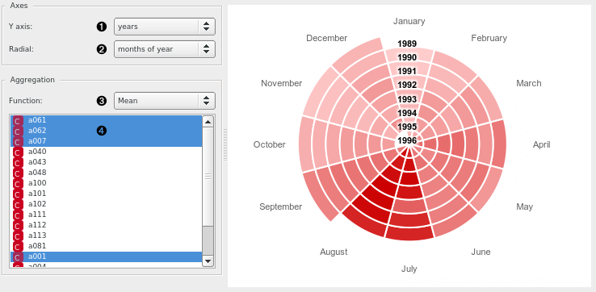

Spiralogram
===========

Visualize variables' auto-correlation.

Signals
-------

Inputs
~~~~~~

-  **Time series**

   Time series as output by :doc:`As Timeseries <as_timeseries>` widget.

Description
-----------

Visualize time series' periodicity in a spiral heatmap.

1. Unit of the vertical axis. Options are:
   years, months, or days (as present in the series);
   months of year, days of week, days of month, days of year,
   weeks of year, weeks of month, hours of day, minutes of hour.
2. Unit of the radial axis (options are the same as for (1)).
3. Aggregation function. The series is aggregated on intervals
   selected in (1) and (2).
4. Select the series to include.

See also
--------
:doc:`Aggregate <aggregate>`

Example
-------
In the example image above that shows traffic for select French highways,
we see a strong seasonal pattern (high summer) and somewhat of an anomaly on
July 1992. In this month, there was
`an important trucker strike <https://www.google.com/search?q=french+trucker+strike+1992>`_ in protest of
new road laws.
