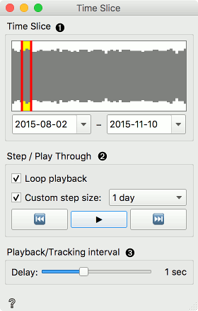
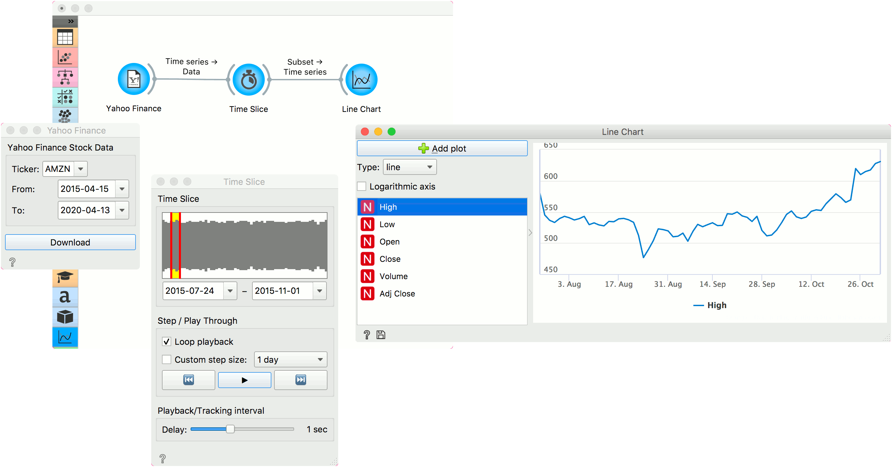

Time Slice
==========

Select a slice of measurements on a time interval.

**Inputs**

- Data: Time series as output by [As Timeseries](as_timeseries.md) widget.

**Outputs**

- Subset: Selected time slice from the time series.

Time slice is a subset selection widget designed specifically for time series and for interactive visualizations. It enables selecting a subset of the data by date and/or hour. Moreover, it can output data from a sliding window with options for step size and speed of the output change.

1. Visual representation of time series with the selected time slice. Click and drag the red lines to adjust the time window, or click and drag the yellow frame to move it around. Alternatively, set the to and from dates below to output the desired subset.
2. If *Loop playback* is selected the data will 'replay' continuously. *Custom step size* defines how the time slice move. If it is set to, say, *1 day*, the window will output n + 1 day once it moves. Without the custom step size defined, the slice will move to the next frame of the same size without any overlap.
   Press play to being the sliding window and stop to stop it. Backwards and forwards buttons move the slice by the specified step size.
3. Set the speed of the sliding window.

Example
-------

This simple example uses [Yahoo Finance](yahoo_finance.md) widget to retrieve financial data from Yahoo, namely the AMNZ stock index from 2015 to 2020. Next, we will use **Time Slice** to observe how the data changed through time. We can observe the output of Time Slice in [Line Chart](line_chart.md). Press *Play* in Time Slice and see how Line Chart changes interactively.

