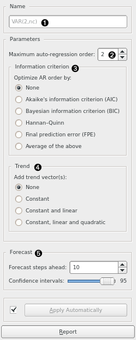

VAR Model
=========

Model the time series using [vector autoregression (VAR) model](https://en.wikipedia.org/wiki/Vector_autoregression).

**Inputs**

- Time series: Time series as output by [As Timeseries](as_timeseries.md) widget.

**Outputs**

- Time series model: The VAR model fitted to input time series.
- Forecast: The forecast time series.
- Fitted values: The values that the model was actually fitted to, equals to *original values - residuals*.
- Residuals: The errors the model made at each step.

Using this widget, you can model the time series using VAR model.

1. Model's name. By default, the name is derived from the model and its parameters.
2. Desired model order (number of parameters).
3. If other than *None*, optimize the number of model parameters (up to the value selected in (2)) with the selected information criterion (one of: AIC, BIC, HQIC, FPE, or a mix thereof).
4. Choose this option to add additional "trend" columns to the data:
    - *Constant*: a single column of ones is added
    - *Constant and linear*: a column of ones and a column of linearly increasing numbers are added
    - *Constant, linear and quadratic*: an additional column of quadratics is added
5. Number of forecast steps the model should output, along with the desired confidence intervals values at each step.

Example
-------

#### See also

[ARIMA Model](arima.md), [Model Evaluation](model_evaluation_w.md)
