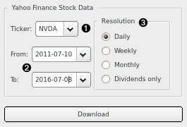

Yahoo Finance
=============

Generate time series from Yahoo Finance stock market data.

Signals
-------

Outputs
~~~~~~~

-  **Time series**

   Time series table of open, high, low, close (OHLC) prices, volume and
   adjusted close price.

Description
-----------

This widget fetches historical stock market data from Yahoo Finance and
outputs it as a time series data table.

1. Stock (e.g. GOOG) or index (e.g. ^DJI) symbol you are
   interested in.

2. Date range you are interested in.

3. Desired resolution of the time series. Can be one of: daily, weekly,
   monthly, or dividends. The last option outputs a table of dates when
   dividends were issued, along with their respective dividend amounts.

Example
-------

Since the output data type is inherently a **Table**, you can connect
it to wherever data table is expected.

.. figure:: images/yahoo-finance-ex1.png

